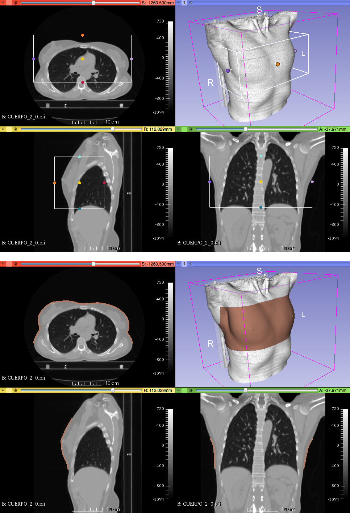
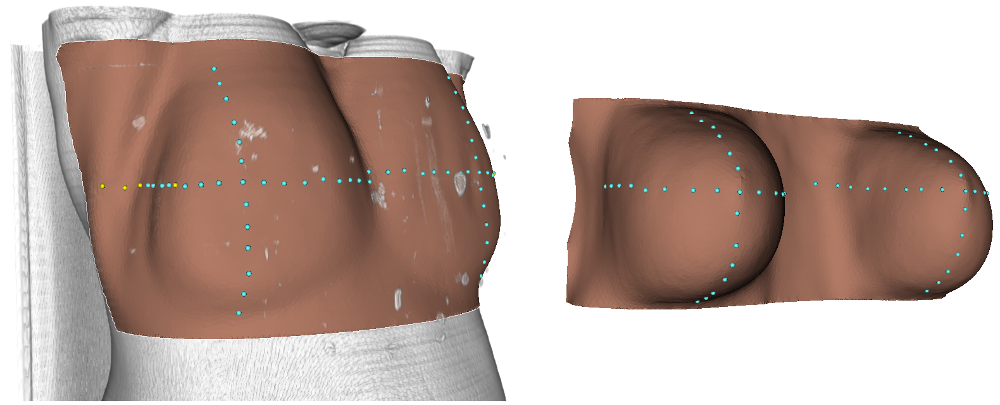
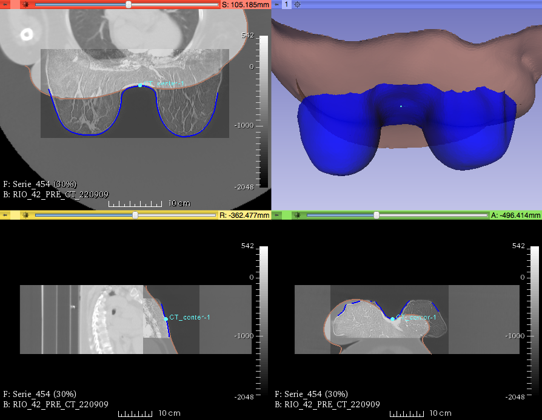
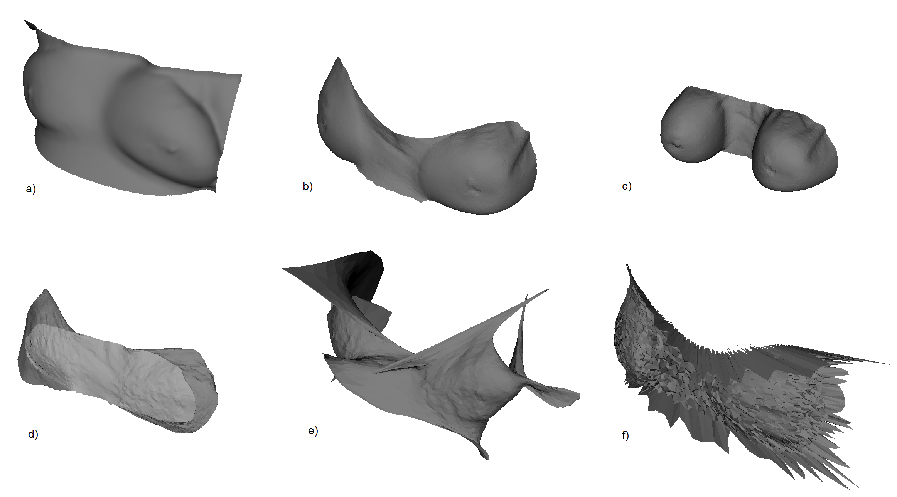
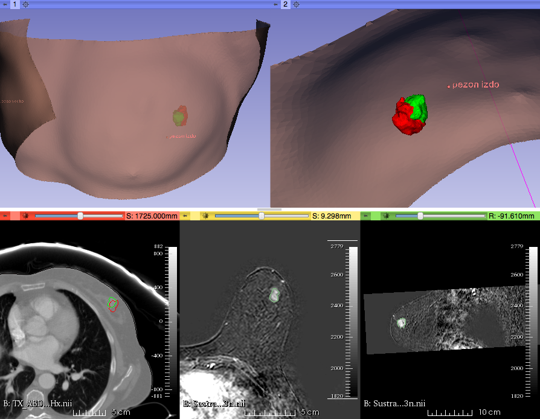
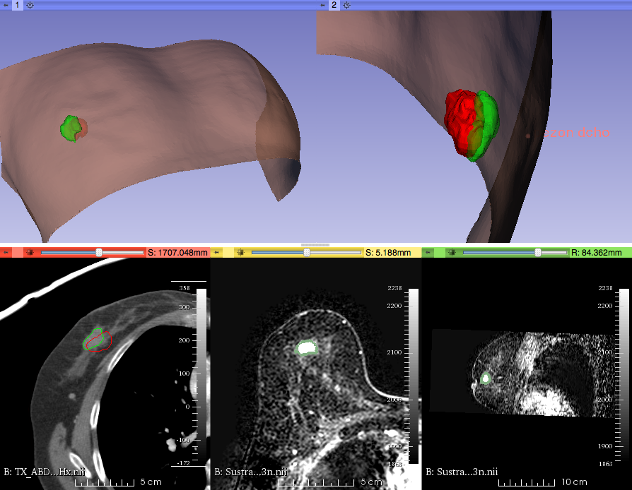
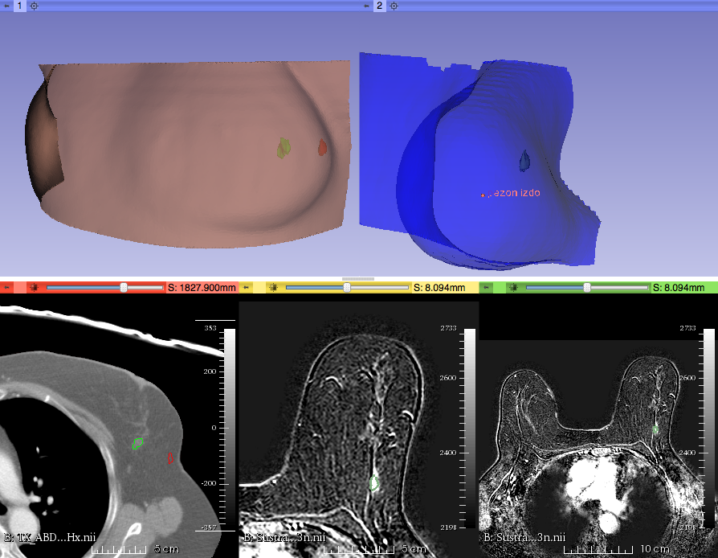

# Multimodal Integration for Surgical Planning in Breast Cancer

This is the code for my Master's thesis at Universidad Politécnica de Madrid ([MEng Biomedical Engineering](http://docencia.gbt.tfo.upm.es/muib/)). I was supervised by [Prof. María J. Ledesma-Carbayo](https://scholar.google.es/citations?user=jCcBex0AAAAJ&hl=en), from the [Biomedical Image Technology (BIT) group](http://www2.die.upm.es/im/).

It consists of a Python module for [3D Slicer](https://www.slicer.org/) and some MATLAB code for most of the image and surface processing.

## Screenshots

3D Slicer module. Selecting the region of interest:

Automatic landmark detection from nipples using geodesic distances on the extracted surfaces:

Initializating the registration using a landmark between the nipples:

a) Supine surface (intraoperative) scanned before surgery (actually, this was extracted from a preoperative CT scan). Target surface for registration.

b) Result of registering the prone surface (c) to the supine surface (a).

c) Prone surface, extracted from a preoperative MRI.

d,e,f) Failed (but fun) registration results.

Two examples of successful projections of preoperative to intraoperative tumor position:

Example of failed projection:

